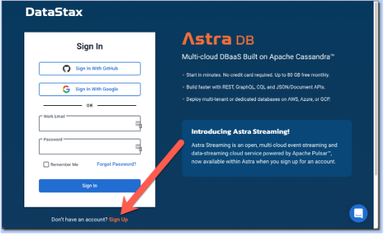
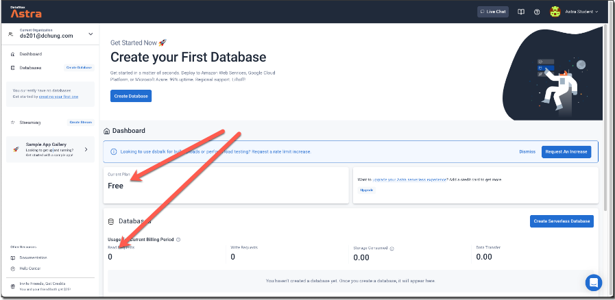
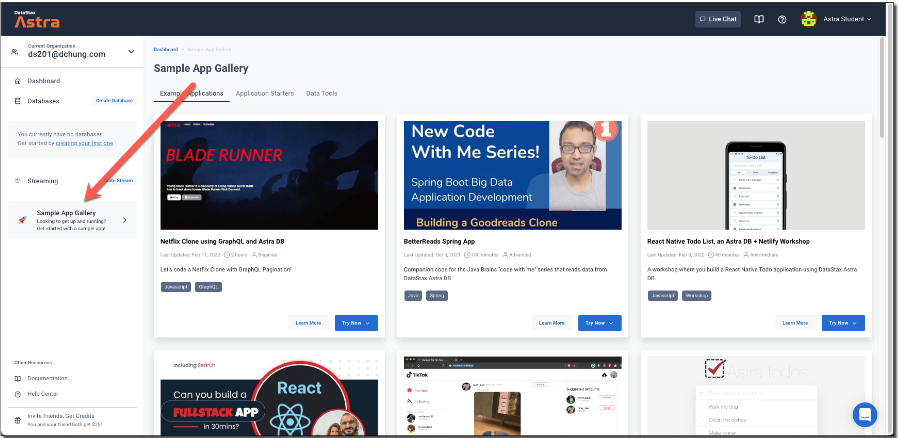
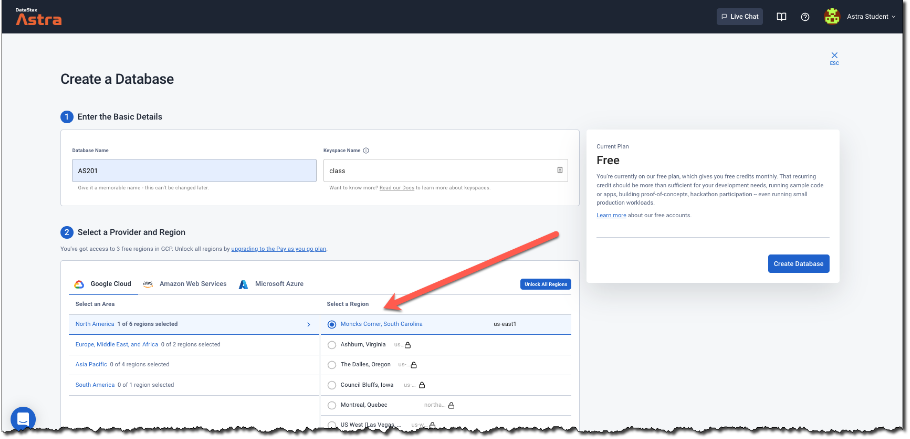
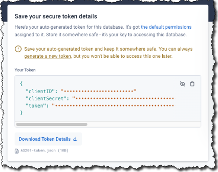
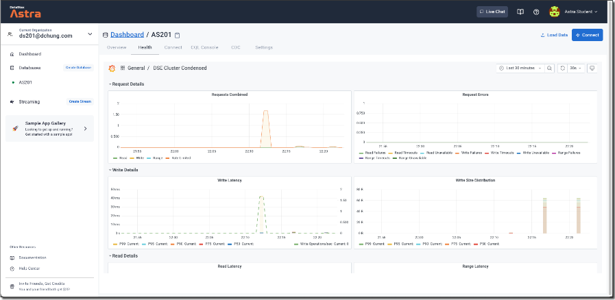
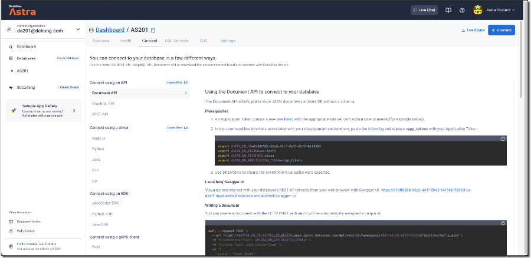
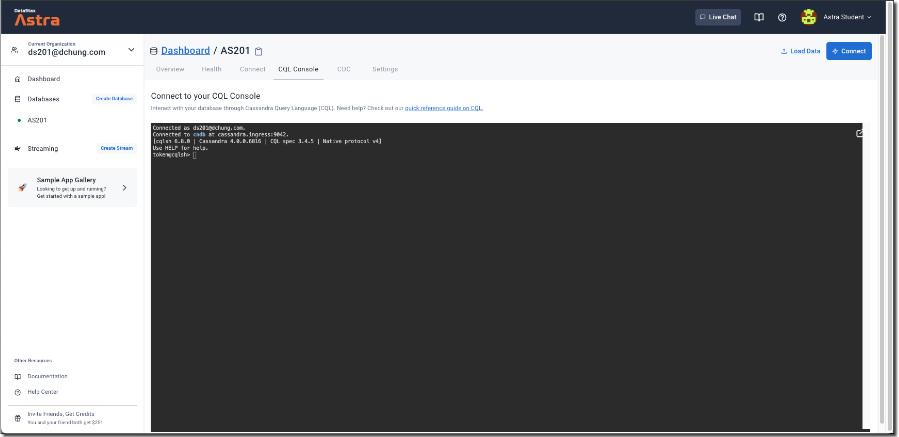

# Labs - Create Astra DB Account

**Estimated Time:** 10 minutes

This module is a pre-requisite to our workshop. We are going to create an free Astra account that provides $25 a month of credits. No payment inforamation is required, but you have to use your work email. 

Topics:

* Create an Astra DB account
* Create a database
* Save Credentials
* Explore the Astra UI

Let's get started!

## Create an Astra DB Account
From you browser, connect to Astra:
1. Go to http://astra.datastax.com
1. Sign up for a free account

> Your Astra account is free! You will not even have to give Datastax a credit card!

This is the basic dashboard. It shows that the user is on the free plan and has no databases.

  
  Fully worked sample applications with video instructions and GitHub repositories for code. Great way to get a jumpstart on building apps using Astra DB!

## Create a Database
Sign-in to your account and follow the steps below. You'll only have to:
1. Specify the database and keyspace name
1. Select cloud provider (AWS, GCP, AZURE) and region

> Not all regions are available for *free* plan use

# Store Credentials
Remote db access requires a secure token
* Download and store in a safe place
* New tokens can be generated later
* Existing tokens cannot be recovered

> At this point there is one database with one keyspace. Since we have not created any tables the read and write requests are zero.

# Explore Astra UI
The Health Tab gives a view of overall database health.

The Connect tab shows all the different ways to connect to Astra DB. There are examples for different APIs, drivers and languages. 

The CQL console is a shell in which you can directly enter CQL commands to interact with your database. Many of the hands-on exercises in this class will use the CQL console.

