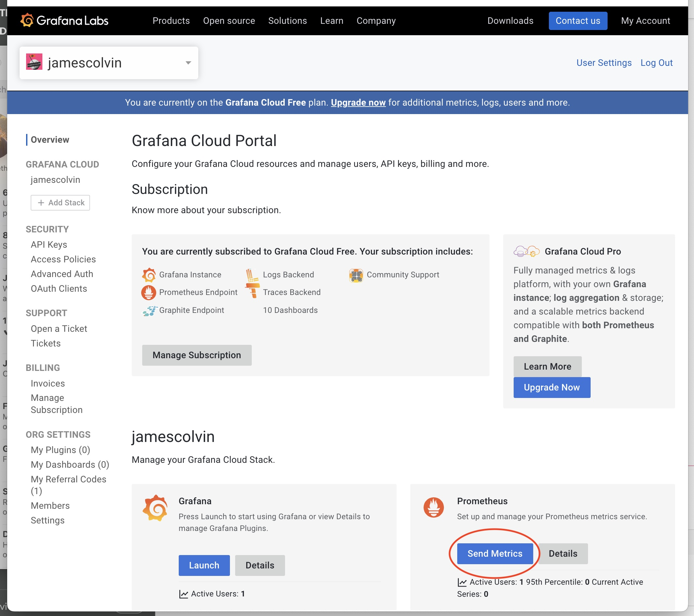
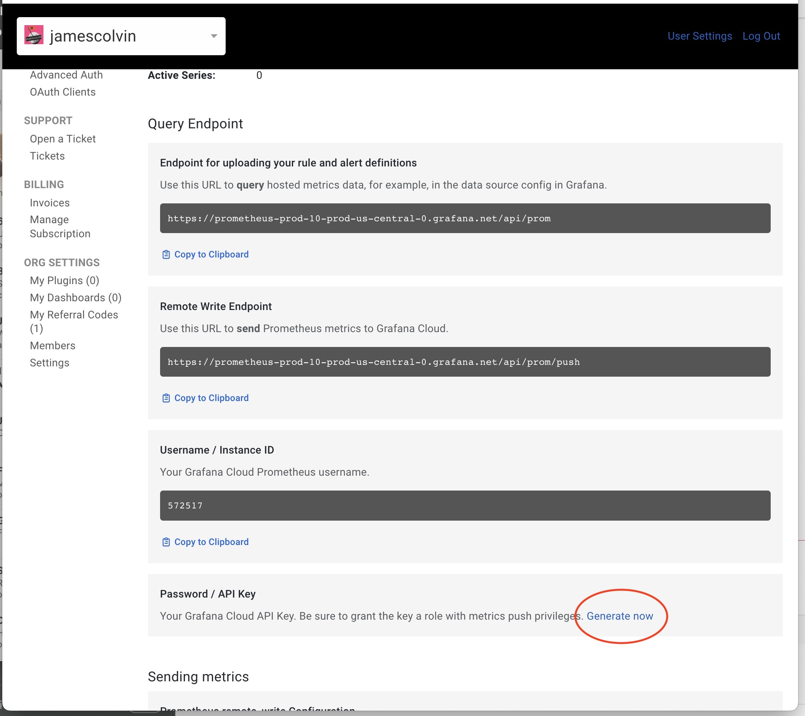
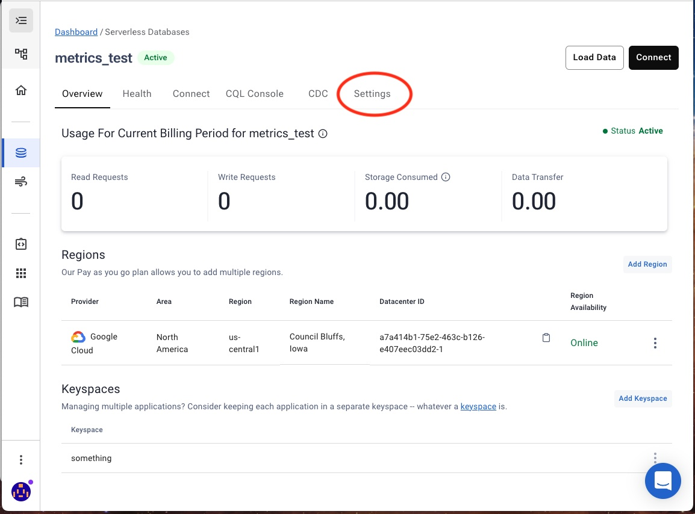
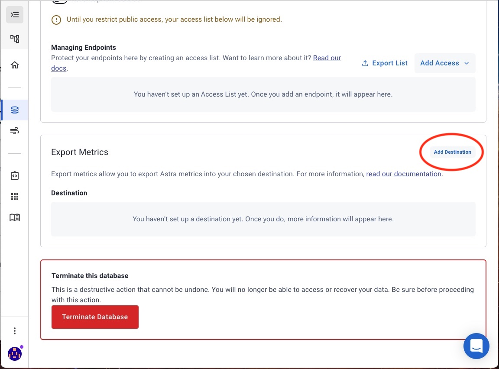
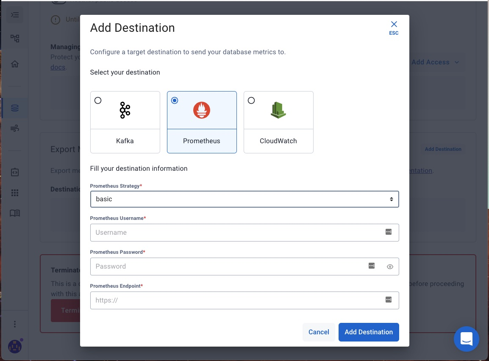
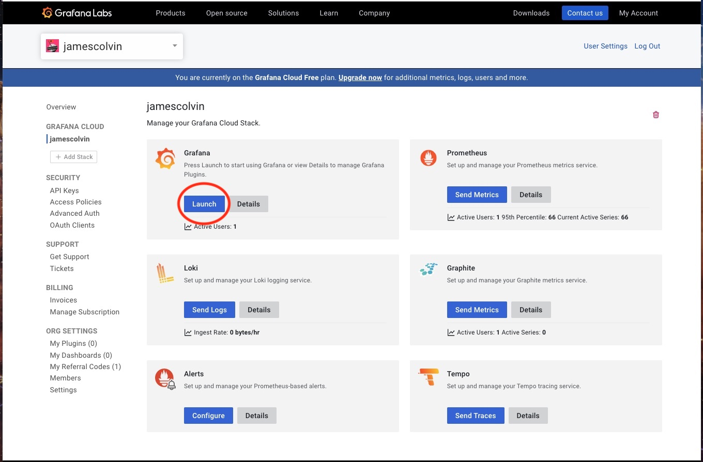
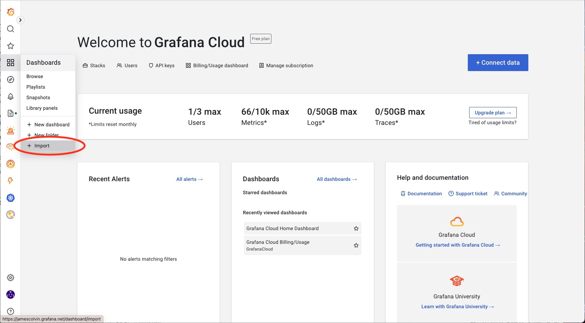
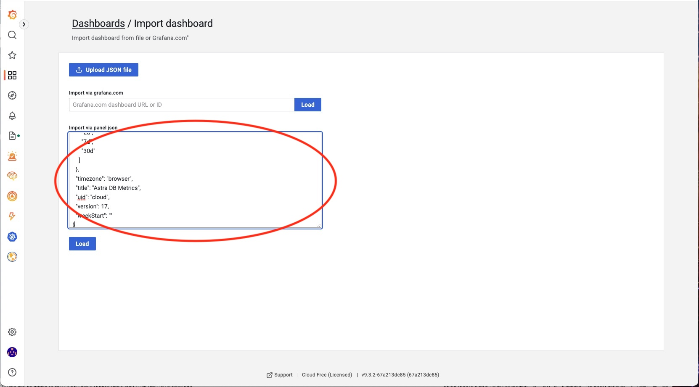
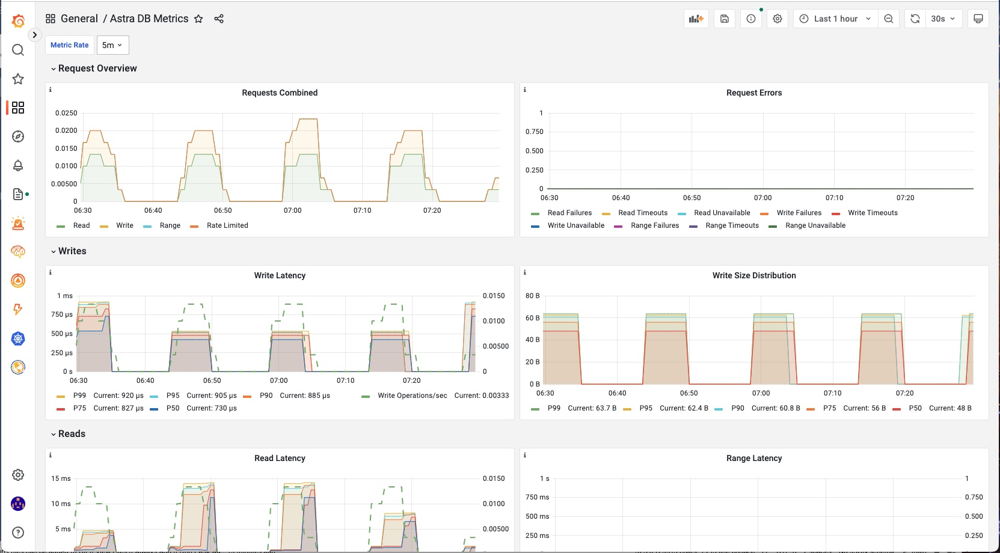

# Prometheus & Grafana Cloud
In this lab we will setup Astra DB third party metrics exporting, and ship metrics to a Prometheus server hosted in Grafana Cloud.
## Prerequsites
- [ ] Free [Astra DB](https://astra.datastax.com) account
- [ ] Free [Grafana Cloud](https://grafana.com/auth/sign-up/create-user?pg=login) account
- [ ] Create an [Astra DB instance](https://astra.datastax.com/org/292fde42-ced8-4d4a-ae21-e61226f03f2d/guide/overviewOfAstraDB#How-to-Create-an-Astra-database-with-the-UI-%F0%9F%94%A5)
## Grafana & Prometheus Setup
You will need the following information to enable metrics export from Astra DB. 
```yaml
remote_write:
- url: https://prometheus-prod-***********.grafana.net/api/prom/push
  basic_auth:
    username: <Your Grafana Cloud Prometheus Username>
    password: <Your Grafana Cloud API Key>
``` 

##### Prometheus URL Info


### Generating an API Key
Select `Generate now` under the section *Password / API Key* and follow the steps. Be sure to save the API key for later steps, as you will not be able to retrieve it after navigating away from this screen.

Ensure the API Key has the `Role` of `MetricsPublisher`
#### Generate API Key


## Astra DB Setup
Select the database you created in the prerequsites, and select the `Settings` tab. Then, select `Add Destination`
#### Settings


#### Add Destination


#### Enter Prometheus Info
Retrieve the Grafana Cloud `username` and `API Key` above and fill in the `Prometheus Username` and `Prometheus Password` respectively.

Use the `Prometheus Write Endpoint` URL as noted in the [Generating an API Key]() section above.



## Grafana Dashboard Setup


### Import Dashboard


Copy the entire `JSON` body from the file `labs/grafana-astra-dashboard.json` and paste into `Import via panel json`. 



### Working Metrics
You should begin to see metrics flowing to your dashboard that roughly resembles the Astra UI Health Tab. 

