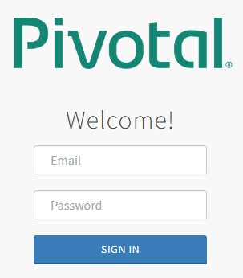
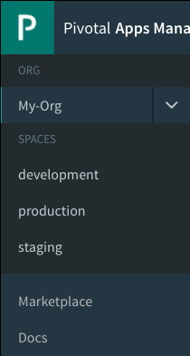

# Explore Applications Manager

## Goal

Now that you've pushed an app, log in to App Manager and explore the many options available.

## Prerequisites

- Internet Access
- Web Browser (Chrome, Firefox, Edge, Safari)(Not Internet Explorer)

## Log in to App Manager

1. Open PAS Apps Manager web site provided in the [Introduction](/demos/intro-creds) slide.
    

1. Log in with the student account creds assigned workshop proctor..

1. Once logged in, notice your Org and Space is automatically loaded.
    

## Locate the home page of your app

1. Click your space name (on the left) to get a list of apps deployed in that space. You should see your app previously pushed.

1. Click the name of your app to see all the details and options.

1. This is the home page of your app. From here you can start/stop the app, manually scale the app instances, manage the services bound to the app, manage routes attached to the app, view the app's logs, and (with Steeltoe) manage logging levels and see in depth debugging.

## Explore the Marketplace

1. Click the "Marketplace" link (on the left).

1. This is a listing of all the services available to bind with your app. [When applicable] a service has plans associated with them. You choose a plan, name the instance, and bind.

1. You don't have to bind a service directly to an app. Alternately, you can bind a service to a Space. This makes the service available for binding to all apps within, but lets the service settings be managed in one place.

