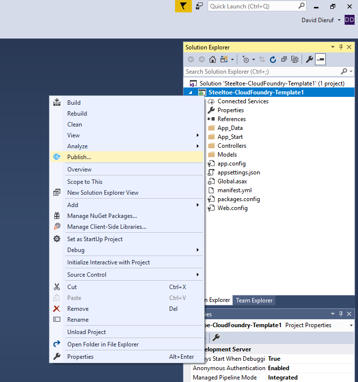
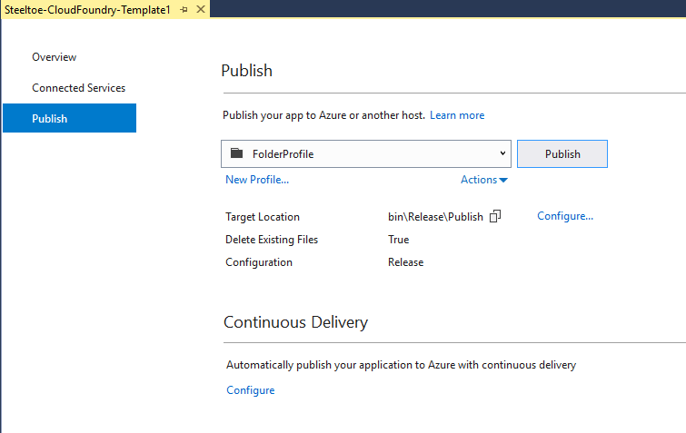

# Push the Microservice to Pivotal Application Services Platform

## Goal

Using Visual Studio, compile the app to create an artifact. Then push the artifact to the Platform, for deployment.

## Prerequisites

- Visual Studio (min 2015)
- PAS API Access
- PAS App Manager Access

## Create the App Artifact

1. With the Steeltoe Microservice app opened in Visual Studio, right click on the project name and choose `publish`. (No need to `build` or `restore`, it will happen automatically)
     

1. The "Publish" window will open where you can choose the `FolderProfile`. Let the other settings remain as default.
     

1. Click the `Publish` button to create a new app artifact. Visual Studio will provide feedback about restoring packages and building the project. Something simiar to:

     ```
     1>  Steeltoe-CloudFoundry-Template1 -> C:\tmp\Steeltoe-CloudFoundry-Template1\bin\Steeltoe-CloudFoundry-Template1.dll
     2>------ Publish started: Project: Steeltoe-CloudFoundry-Template1, Configuration: Release x64 ------
     2>Connecting to C:\tmp\Steeltoe-CloudFoundry-Template1\bin\Release\Publish...
     2>Deleting existing files...
     2>Publishing folder /...
     2>Publishing folder bin...
     2>Web App was published successfully file:///C:/tmp/Steeltoe-CloudFoundry-Template1/bin/Release/Publish
     2>
     ========== Build: 1 succeeded, 0 failed, 0 up-to-date, 0 skipped ==========
     ========== Publish: 1 succeeded, 0 failed, 0 skipped ==========
     ```

1. In the output window, note the location of the newly created artifact. Your location will be a little different, but in the above example it's `C:/tmp/Steeltoe-CloudFoundry-Template1/bin/Release/Publish`. This folder has the compiled DLL, runtime dependencies, and the PAS manifest. That is your artifact!

## Log in to PAS

1. Open a powershell window.

2. Log in to PAS. You can copy and paste the following command into your powershell window to login. This command requires that you have setup the environment variables discussed earlier.

   ```
   cf login -a $env:cf_api -u $env:cf_username -p $env:cf_password
   ```

    If necessary, you can validate the existence of environment variables with the following commands:

    ```powershell
   Get-ChildItem env:cf_api
   Get-ChildItem env:cf_username
   Get-ChildItem env:cf_password
    ```

3. You may be prompted to choose an Org and Space. Choose the organization and space specified by your proctor. If you are not prompted, by default your Org and Space have already been set.

4. To confirm you have targeted the correct Org and Space, type `cf target`. The output of this command will be similar to the following: 

    ```powershell
    PS C:\> cf target
    api endpoint:   https://api.system.pcf.acme.io
    api version:    2.120.0
    user:           wcoyote@acme.io
    org:            my-micro-service-1
    space:          sandbox
    ```

    The Org and Space are where your app will be pushed to. To target a specific organization and space use the following command: 

    ```powershell
    cf target -o <specify org> -s <specify space>
    ```

## Push the Artifact

With the app artifact created, the appropriate Org and Space targeted in PAS, you are ready to push!

1. In the powershell window, `cd` into the directory holding the artifact. This is the directory you published into from Visual Studio. Example:

     ```powershell
     PS C:\> cd C:/tmp/Steeltoe-CloudFoundry-Template1/bin/Release/Publish
     ```

1. In the powershell window, type the command `cf push`. Your Artifact will be staged in a temporary place on PAS, containerized, deployed, and a route bound to it. Easy!

     ```bash
     requested state: started
     instances: 1/1
     usage: 1G x 1 instances
     urls: my-app-host-name.domain.com
     last uploaded: Mon Jan 7 01:01:10 UTC 2000
     stack: windows2016
     buildpack: binary

          state     since                    cpu      memory         disk           details
     #0   running   2000-01-01 01:01:01 PM   231.0%   498.1M of 1G   161.9M of 1G (10)
     ```

1. Validate that the microservice is running. The microservice URL is the URL output in the previous step plus the suffix of `/api/values/5`. For example, the above output had the URL as `my-app-host-name.domain.com` and the associated microservice URL would be `https://my-app-host-name.domain.com/api/values/5`. Open this URL in your browser to see the microservice in action.


## Complete

Congratulations! You've pushed your first app! 